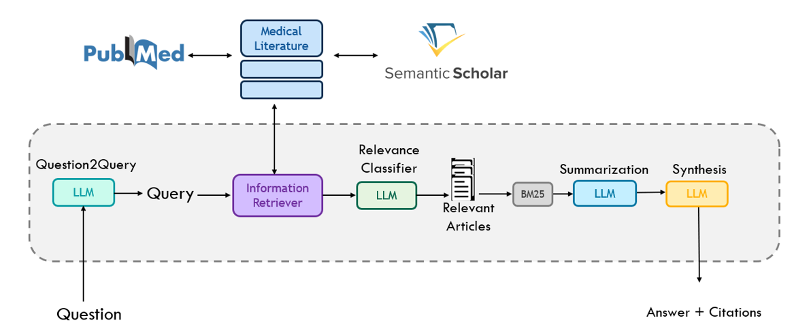

 
 
 Welcome to our work,which is based on Clinfo.ai, if you woud like to see some functionality or have a comment, open an issue on this repo.

 Clinfo.ai: https://github.com/som-shahlab/Clinfo.AI/tree/main


## What type of questions can I ask? 
Questions based on scientific evidence reported in the literature

* Examples:

1. What percentage of HIV-positive patients transmit the virus to their children?

2. When do most episodes of COVID-19 rebound after stopping paxlovid treatment?

3. Does magnesium consumption significantly improve sleep quality?


## How it works?




## Install 
1.Install the conda enviroment using the yml file provided.

``` conda env create -f environment.yaml ```


2.activate the environment:

``` conda activate clinfo ```

## Run

refer to ./src/notebooks/1_ClinfoAI_pipeline.ipynb


